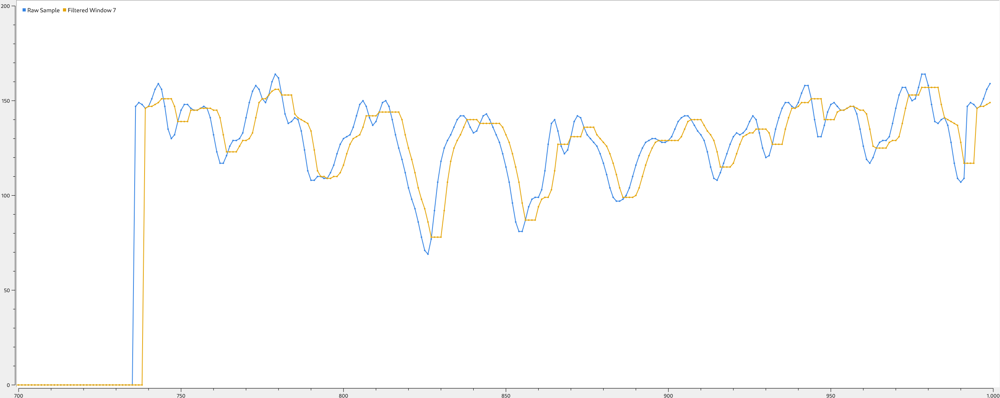
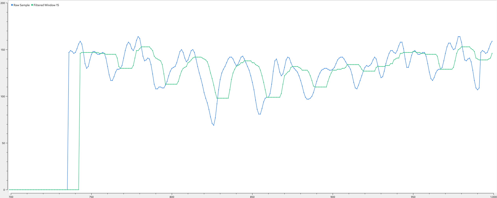
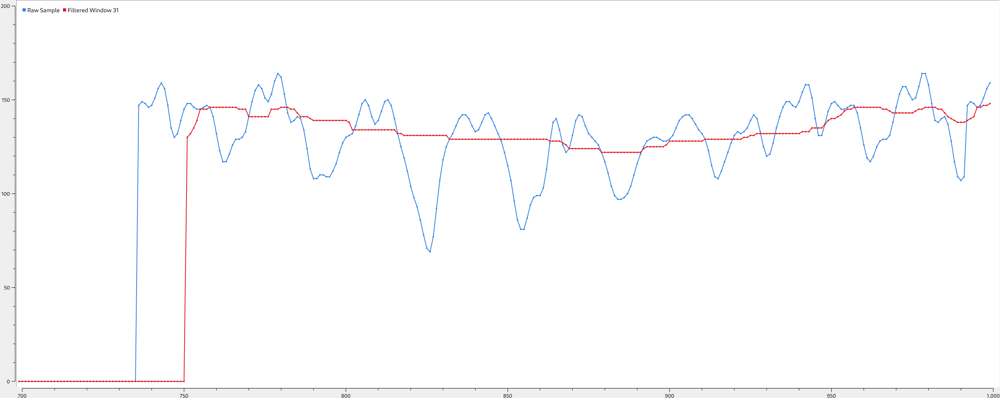

# MEDIAN FILTER

## PRINCIPLE
The Median filter smooths a signal by removing spikes. The median filter can be used both on images and on 1-dimensional signal problems. The median is calculated by sorting a list of numbers and finding the number in the middle. (this is not the actual implementation)

The median filter has a window size, determining how far it will look back. For example, a window size of 9 will have eight elements looking back and one new element. The filter returns the median of these nine elements.

## THEORY EXAMPLE
And ADC loads samples in a 5 sample window of the filter, at time `t0` the windows looks like this:
```
[2, 3, (5), 80, 81]
```
At time `t0` the median value is `5`. Note that the window is sorted.

At time `t1` the ADC returns a new sample with value `90`. Lets say the oldest inserted sample in the window is the one with value `3`.
```
t0:            [2, 3,  (5), 80, 81]
t1:  ADC -90-> [2, 5, (80), 81, 90] -> 80 median value a.k.a filtered output
                                    +-X-> 3 discarded
```
The new sample is correctly inserted in the window (keep sorting), the oldest one is popped and the filter returns `80` as the new median value.

## REAL DATA EXAMPLE & PERFORMANCE
Three filter implementations are fed with the samples that can be found in the following [file](https://gist.github.com/simoneruffini/ef8bbe7abfdde949d6c045d308406161). One filter with a window of 7 samples, one with 15 and one with 31. The following results are achieved:



Increasing the window size increases the smoothing factor but adds delay/phase. 

Below the min/max delays of the filter insert function for this particular data-set:
|window size| min/max clk cycles for insert |
|-----|-------|
| 7|108/196|
|15|100/294|
|31|102/496|

The clk cycles used to insert new samples are not fixed because the filter needs to correctly insert the sample in the ordered window, therefore O(window_len) is the the complexity extereme in the time domain.

The following is a snippet of code showing the test procedure:
```c
static struct MEDFILT_Node medfilt_wndw7[7];
static struct MEDFILT_Handle hmedfilt7={.window_len=7, .window=medfilt_wndw7};
static struct MEDFILT_Node medfilt_wndw15[15];
static struct MEDFILT_Handle hmedfilt15={.window_len=15, .window=medfilt_wndw15};
static struct MEDFILT_Node medfilt_wndw31[31];
static struct MEDFILT_Handle hmedfilt31={.window_len=31 , .window=medfilt_wndw31};

MEDFILT_Init(&hmedfilt7);
MEDFILT_Init(&hmedfilt15);
MEDFILT_Init(&hmedfilt31);
while (1)
  {
    uint8_t sample = sinewave[sample_cnt%256];

    time_start7 = __HAL_TIM_GET_COUNTER(&htim7);
    filtered_sample7 = MEDFILT_Insert(&hmedfilt7,sample);
    time_end7 = __HAL_TIM_GET_COUNTER(&htim7);

    time_start15 = __HAL_TIM_GET_COUNTER(&htim7);
    filtered_sample15 = MEDFILT_Insert(&hmedfilt15,sample);
    time_end15 = __HAL_TIM_GET_COUNTER(&htim7);

    time_start31 = __HAL_TIM_GET_COUNTER(&htim7);
    filtered_sample31 = MEDFILT_Insert(&hmedfilt31,sample);
    time_end31 = __HAL_TIM_GET_COUNTER(&htim7);

    char buf[50];
    uint32_t cycles7 = min(((uint16_t)(-1U))-abs(time_end7-time_start7),abs(time_end7-time_start7));
    uint32_t cycles15 = min(((uint16_t)(-1U))-abs(time_end15-time_start15),abs(time_end15-time_start15));
    uint32_t cycles31 = min(((uint16_t)(-1U))-abs(time_end31-time_start31),abs(time_end31-time_start31));
    sprintf(buf,"%u,%u,%lu,%lu,%lu,%lu,%lu,%lu\n\r",(uint8_t)sample_cnt%256,sample,filtered_sample7,filtered_sample15,filtered_sample31,cycles7,cycles15,cycles31);
    HAL_UART_Transmit(&huart2,(uint8_t *)buf,strlen(buf),100U);
    HAL_Delay(100);

    sample_cnt++;
  }
```
## WHEN TO USE THIS FILTER
This filter is intended for filtering of data with spurious noise. 
A median filter is a nice method for removing noise or peaks from the signal and can often be used as a preprocessing step in front of more advanced filters, like a Kalman filter. The difference between a Median filter and more advanced filters is that a Median filter does not fold the extreme values into the signal like in an average filter and therefore removes their impact on the signal.

## HOW TO USE THIS FILTER
`#include` the single [header file library](./median_filter.h) in your project. Look in the header description for a howto snippet.

## REFENCES
- [original article](https://onlinedocs.microchip.com/pr/GUID-2607C185-2590-41FF-8911-0DAD5D1E3F69-en-US-5/index.html?GUID-6A33F45D-59E7-4DAD-8305-1CC428DBEB1E)
- [wikipedia](https://en.wikipedia.org/wiki/Median_filter)
